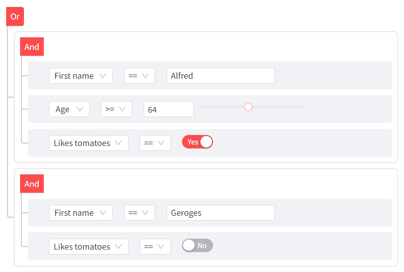

Based on [react-awesome-query-builder](https://github.com/ukrbublik/react-awesome-query-builder)

Check out [live demo](https://condition-tree-demo.streamlit.app/) !

This component allows users to build complex condition trees that can be used to filter a dataframe or build a query.




## Install

`pip install streamlit-condition-tree`


## Features
- Highly configurable
- Fields can be of type:
  - simple (string, number, bool, date/time/datetime, list)
  - structs (will be displayed in selectbox as tree)
- Comparison operators can be:
  - binary (== != < > ..)
  - unary (is empty, is null)
  - 'between' (for numbers, dates, times)
  - complex operators like 'proximity'
- RHS can be:
  - values
  - another fields (of same type)
  - functions (arguments also can be values/fields/funcs)
- LHS can be field or function
- Reordering (drag-n-drop) support for rules and groups of rules
- Export to MongoDb, SQL, JsonLogic, SpEL or ElasticSearch

## Basic usage

### Filter a dataframe

```python
import pandas as pd
from streamlit_condition_tree import condition_tree, config_from_dataframe

# Initial dataframe
df = pd.DataFrame({
    'First Name': ['Georges', 'Alfred'],
    'Age': [45, 98],
    'Favorite Color': ['Green', 'Red'],
    'Like Tomatoes': [True, False]
})

# Basic field configuration from dataframe
config = config_from_dataframe(df)

# Condition tree
query_string = condition_tree(config)

# Filtered dataframe
df = df.query(query_string)
```

### Build a query

```python
import streamlit as st
from streamlit_condition_tree import condition_tree

# Build a custom configuration
config = {
    'fields': {
        'name': {
            'label': 'Name',
            'type': 'text',
        },
        'qty': {
            'label': 'Age',
            'type': 'number',
            'fieldSettings': {
                'min': 0
            },
        },
        'like_tomatoes': {
            'label': 'Likes tomatoes',
            'type': 'boolean',
        }
    }
}

# Condition tree
return_val = condition_tree(
    config,
    return_type='sql'
)

# Generated SQL
st.write(return_val)
```

## API

### Parameters

```python
def condition_tree(
    config: dict,
    return_type: str,
    tree: dict,
    min_height: int,
    placeholder: str,
    key: str
)
```

- **config**: Python dictionary (mostly used to define the fields) that resembles the JSON counterpart of
  the React component.
   
A basic configuration can be built from a DataFrame with `config_from_dataframe`.  
For a more advanced configuration, see the component [doc](https://github.com/ukrbublik/react-awesome-query-builder/blob/master/CONFIG.adoc)
and [demo](https://ukrbublik.github.io/react-awesome-query-builder/).  
  *Note*: Javascript functions (ex: validators) are not yet supported.


- **return_type**: Format of the returned value :
  - queryString
  - mongodb
  - sql
  - spel
  - elasticSearch
  - jsonLogic  

  Default : queryString (can be used to filter a pandas DataFrame using DataFrame.query)


- **tree**: Input condition tree (see section below)
  
  Default : None


- **min_height**: Minimum height of the component frame
  
  Default : 400


- **placeholder**: Text displayed when the condition tree is empty
  
  Default : None


- **key**: Fixed identity if you want to change its arguments over time and not have it be re-created.  
Can also be used to access the generated condition tree (see section below).

  Default : None


### Export & import a condition tree

When a key is defined for the component, the condition tree generated is accessible through `st.session_state[key]` as a dictionary.  
It can be loaded as an input tree through the `tree` parameter.


## Potential future improvements
- **Javascript support**: allow injection of javascript code in the configuration (e.g. validators)
